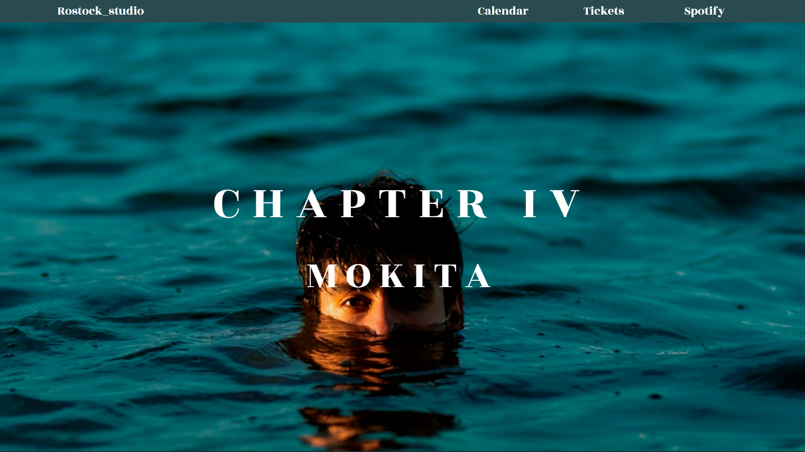

# Diseño de una web de musica
Proyecto donde mejoro mi habilidad con css-grid y experimento con imagenes animadas
## Links de interes
<!-- link a correo -->
<code> </code>
<code></code>

## Estado del proyecto
|             ESTADO                |             |
| -------------------------- | :----------------: | 
| Proyecto terminado           |         ✔️    | 

## Tecnologias usadas
IDE

<code></img></code>

Programas usados

<code></img></code>
<code></img></code>
 
 
Programacion

<code></img></code>
<code></img></code>

## Vista previa del proyecto
</img>

## Inspiracion del proyecto
Diseño creado en <a href="https://www.figma.com/file/kP0SJhf4iDDa9kAzsz1LM1/Github-projects?node-id=0%3A1">figma</a> por Carlos cruz valencia
## Licencia
Este proyecto está bajo la Licencia (Tu Licencia) - mira el archivo LICENSE.md para mas detalles